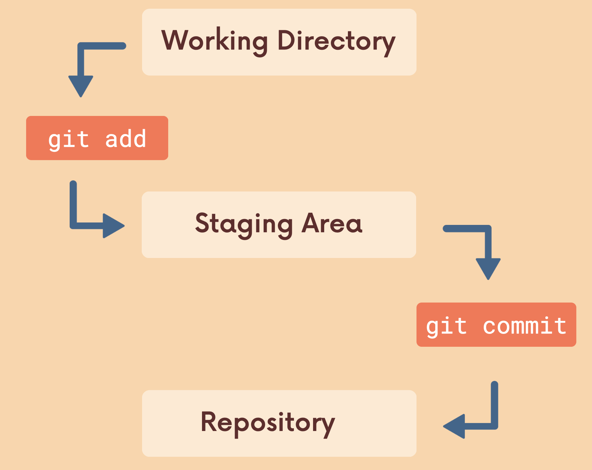

# Basics of Git: Adding & Committing

- [Slides](https://www.canva.com/design/DAEPH_Lq4Wk/Wp_d5Rvk_OjVvgPH0xmzhg/view?utm_content=DAEPH_Lq4Wk&utm_campaign=designshare&utm_medium=link&utm_source=sharebutton)

# What is a Git Repo?

- Git repo is a workspace which tracks and manages files within a folder.
- Anytime we want to use Git with a project, app, etc. need to create a new git repository.
- Can have as many repos on our machine as needed, all with separated history and content on our machine.

## `git status` and `git init`

- `git status`: gives information on the current status of a git repository and its contents.
- `git init`: create an empty Git repository or reinitialize an existing one.
  - creates a hidden file `.git`
  - hidden files begin with a `.`

---

# Git Basic Workflow

1. Work on Stuff
   - Make new files, edit files, delete files, etc.
2. Add Changes
   - Group specific changes together, in preparation of committing.
3. Commit
   - Commit everything that was previously added.

## `git add`

- `git add`: add specific files to the staging area.
- Syntax: `git add file1 file2`
- `git add .` stages all changes at once.

## `git commit`

- `git commit`: taking a snapshot of a git repository in time.
- Syntax: `git commit -m <commit_message>`
- Running `git commit` opens up VIM (try to avoid this).
- commit changes from the staging area. need to provide a commit message.
- When saving a file, we are saving the state of a single file.
- With Git, we can save the state of multiple files and folders together.

## `git log`

- `git log`: shows a list of all the commits made to a repository.

---

# Commits in Detail

## Atomic Commits

- Keep each commit focused on a single thing.
- A commit should encompass a single feature, change or fix.

## Avoid `git commit` without `-m`

- This opens up VIM editor.
- Type `i` to enter the insert mode as it forces you to enter a commit message.
- Then, _ESCAPE KEY_ --> `:wq` --> _ENTER_
  - `w`: write, `q`: quit

## `code --wait`

- `git config --global core.editor "code --wait"` (FOR VSCode)
- COMMAND + SHIFT + P --> Install 'code' command in PATH.
- `git commit`
  - opens up a git editor in vscode instead of VIM.
  - enter the commit message.
  - once done, just close the file and it will commit.

## Shorten Commit Message in `git log`

- `git log --oneline"
  - view the first line of each commit message.

## Amend Commits

- After making a commit, maybe you _forgot to include a file_, or there is a _typo in commit message_.
- `git commit --amend`
  - redo the previous 1 commit.
  - opens up VIM
- `git add` then commit again.

## `.gitignore`

- [Useful .gitignore](https://www.toptal.com/developers/gitignore/)
- Can tell Git which files and directories to ignore in a given repository, using a `gitignore` file.
- Will also ignore any changes to those files.
- Useful for file you never want to commit:
  - Secrets, API Keys, credentials, etc.
  - Operating System Files (.DS_Store on Mac)
  - Log Files
  - Dependencies & Packages
- Put in the root of the repository.
  - write exact file names
  - write folder name
  - `*.py`: ignore all python files. or `*.log`: ignore all log files.
