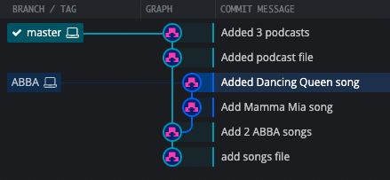
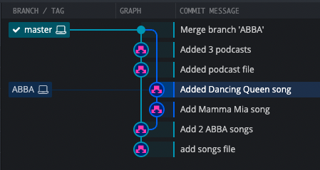

# Git Merge

- Incorporate changes from one branch to another.
- use the `git merge` command.
- Merge branches, not specific commits.
- Always merge to the current HEAD branch.

## Fast Forward Merges

- The HEAD pointer is simply **moved forward to point to the latest commit** in the source branch.
- Fast Forward Merges are often used to merge changes from a feature branch back into the main branch (single source of truth).
- E.g., To merge the bugfix branch into the master branch
  1. Switch to the branch you want to merge the changes into (the receiving branch)
     - `git switch master`
  2. Use the `git merge` command to merge changes from a specific branch into the current branch.
     - `git merge bugfix`

## Git Merge & Merge Commits

- E.g., One of your teammates merged in a new feature or change to master while you were working on a branch.
  - Rather than performing a simple fast forward, git performs a "merge commit".
  - End up with a new commit on the master branch.
  - Git will prompt you for a message.

## Resolving Merge Conflicts

- Merge Conflict
    - Depending on the specific changes you are trying to merge, Git may not be able to automatically resolve.
    - Resolve manually.
- To resolve the conflicts:
    1. Open up the file(s) with merge conflicts.
    2. Edit the file(s) to remove the conflicts. Decide which branch's content you want to keep in each conflict. Or keep the content from both.
    3. Remove the conflict "markers" in the document.
    4. Add your changes and then make a commit.

## Using VSCode To Resolve Conflicts

- Accept Current Changes.
- Accept Incoming Changes.
- Accept Both Changes.

