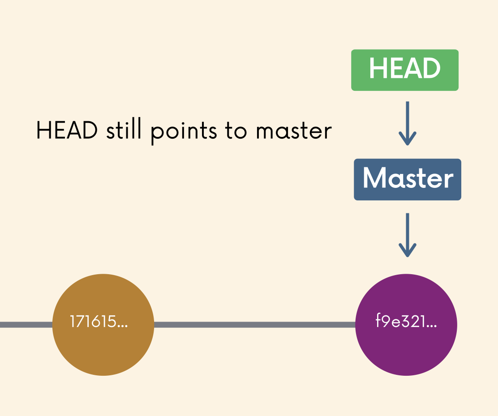
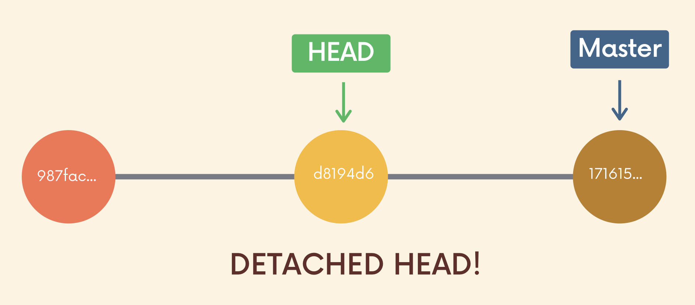
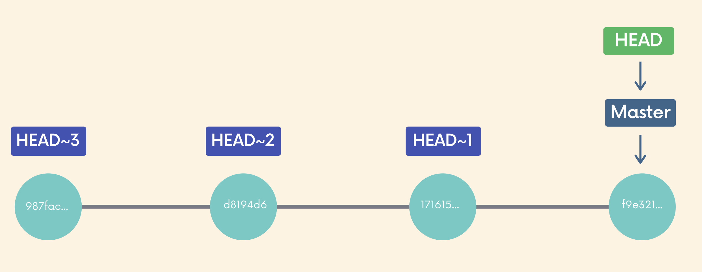

# Undoing Changes & Time Traveling

## More about **HEAD**

- Usually, HEAD points to a specific branch reference rather than a particular commit.
    - HEAD is a pointer to the current branch reference.
    - The branch reference is a pointer to the last commit made on a particular branch. (HEAD -> Master -> 171615...)
- When we make a new commit, the branch pointer is updated to reflect the new commit.
- The HEAD remains the same, because it is pointing at the branch reference.

- When you switch branches, HEAD is updated to point to the specific branch reference.
- HEAD usually reference to a branch NOT a specific commit.

## `git checkout <commit_hash>`

- `git checkout <commit_hash>`: to view a previous commit
    - use `git log` to view commit hashes. Just need the first 7 digits. Can also use `git log --oneline` to easily get the first 7 digits.

## Detached HEAD

- `git checkout <commit_hash>`
    - When we checkout a particular commit, **HEAD points at that commit** rather than at the branch pointer.
    - E.g., `git checkout d8194d6`

- Things to do in Detached HEAD
    1. Examine the contents of the old commit.
    2. Leave and go back to wherever you were before - reattach the HEAD.
    3. Create a new branch and switch to it. Can not make and save changes, since HEAD is no longer detached.

## Re-attach HEAD

- Switch back to whatever branch you were on before.
    - E.g., `git switch master`

## `git checkout HEAD~1`

- `git checkout` supports referencing previous commits relative to a particular commit.
    - HEAD~1 refers to the commit before HEAD
    - HEAD~2 refers to 2 commits before HEAD
    - `git checkout HEAD~1` and `git checkout HEAD~2`

- Discarding Changes in Working Directory
    - Made changes to a file in working directory but don't want to keep those changes in that file.
    - To revert file back to how it looked like in the last commit, use `git checkout HEAD <filename>` to discard any changes in that file, reverting back to HEAD.
    - Alternatively, use `git checkout -- <filename>`

## `git restore`

- `git restore <file_name>`
    - Undo modifications in the **working directory**, reverting the file to the last committed state.
    - Restores the file to the contents in the HEAD.
- `git restore --source HEAD~1 <file_name>`
    - Restore the contents of the file to its state from the commit prior to HEAD.
- Unlike `git restore <file_name>` which restores the file to the current commit, `git restore --source HEAD~1 <file_name>` restores the file to the previous commit (one commit before the current commit).
- `git restore --staged <file_name>`
    - Restore files in staging area that were added by `git add` back to the working directory.
    - E.g., `git restore --staged app.js` or `git restore --staged .` for all files in the staging area.

## `git reset`

- `git reset <commit_hash>`
    - To undo commits and reset the repo back to a specific commit.
    - Commits removed but the file changes based on the removed commits will appear in the working directory.
- `git reset --hard <commit_hash>`
    - Undo both the commits and the actual changes in the files.
    - `git reset --hard HEAD~1` deletes the last commit and associated changes.

## `git revert`

