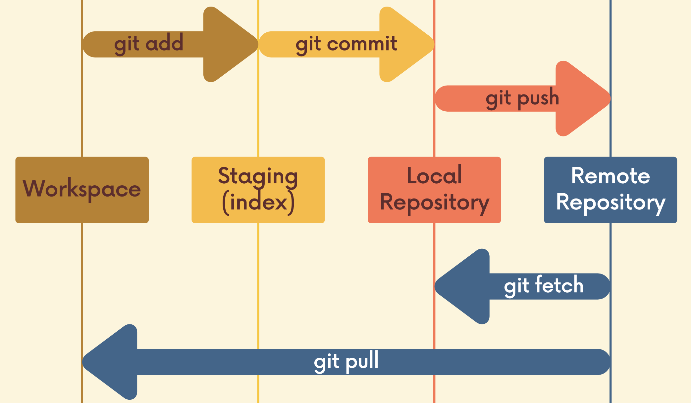

# GitHub Basics

## Git vs GitHub

- **Git**: version control software that runs locally on your machine. Don't need to register for an account. Don't need the Internet to use it. Can use Git without touching GitHub.
- **GitHub**: service that hosts Git repositories in the cloud and makes it easier to collaborate with other people. Need to sign up for an account to use GitHub. An online place to share work that is done using Git.

## Reasons to use GitHub

- Collaboration
- Open Source Projects
- Exposure: showcase own projects and contributions to others' projects.
- Stay Up To Date
- Cloning: get a **local copy of an existing repository**.

## Cloning

- `git clone <url>`
    - To clone a repo.
    - Git retrieves all the files associated with the repository and copies the to the local machine.
    - During cloning, Git initializes a new repository on the local machine, giving you access to the full Git history of the cloned project.
- **Anyone can clone a repository from GitHub**, provided the repo is public.

## 2 Methods to get the code on GitHub

1. Existing Repository Locally
    - Create a new repo on GitHub
    - Connect local repo (add a remote)
    - Push changes to GitHub
2. Start from scratch - no work on local
    - Create a brand new repo on GitHub
    - Clone to local machine
    - Do some work locally
    - Push changes to GitHub

## What is *origin*?

- *Origin* is a conventional Git remote name, just a name for a URL.
- When we clone a GitHub repo, the default remote name setup is called *origin*.

## Remote

- Before pushing up to GitHub, Git needs to know the *remote* repository on GitHub which is the "destination" to push up to.
- These "destinations" are referred to as remotes.
- Each remote is simply a URL where a hosted repository lives.
- `git remote`: view existing remotes for repository.
- `git remote -v`: view existing remotes for repository (verbose)
- `git remote add <name> <url>`: adding a new remote, specifying label for remote and the remote URL.
- `git remote rename <old> <new>`: rename a remote
- `git remote remove <name>`: delete a remote

## Pushing

- `git push <remote> <branch>`: pushing up work from local branch to remote.
  - E.g., `git push origin main` or `git push origin newfeature`
- `git push <remote> <local_branch>:<remote_branch>`
  - E.g., `git push origin pancake:waffle`

## Workflow

## Pushing to Upstream

- `git push -u origin master` or `git push --set-upstream origin master`
  - `-u` or `--set-upstream` is used to set the upstream branch.
  - Usually run this command for the first time then can use `git push` without specifying the branch name in future.
  - By setting the upstream branch, we establish a connection between local branch and the corresponding branch on the remote repository.
  - Allows us to easily push and pull changes without having to specify the branch every time.
- `git branch -M main`
  - Renames the current branch to "main".