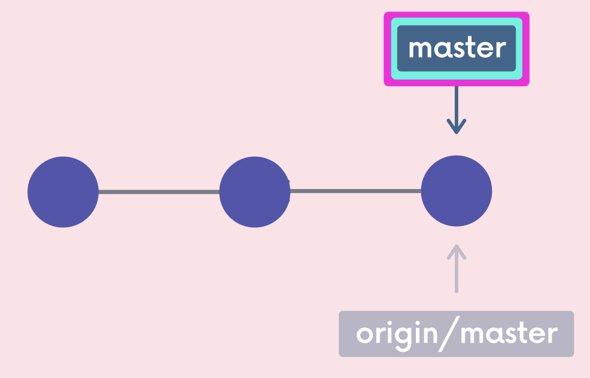
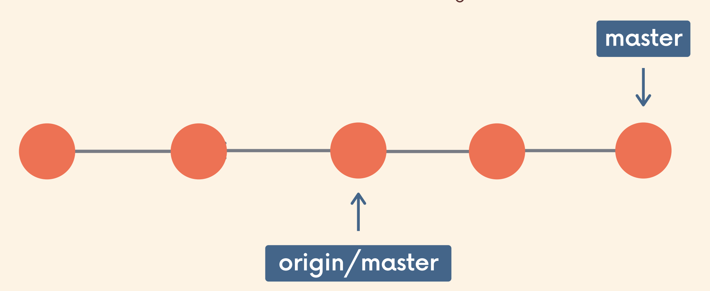
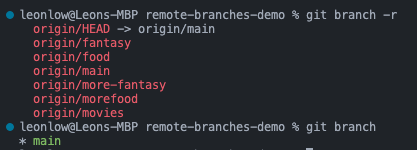
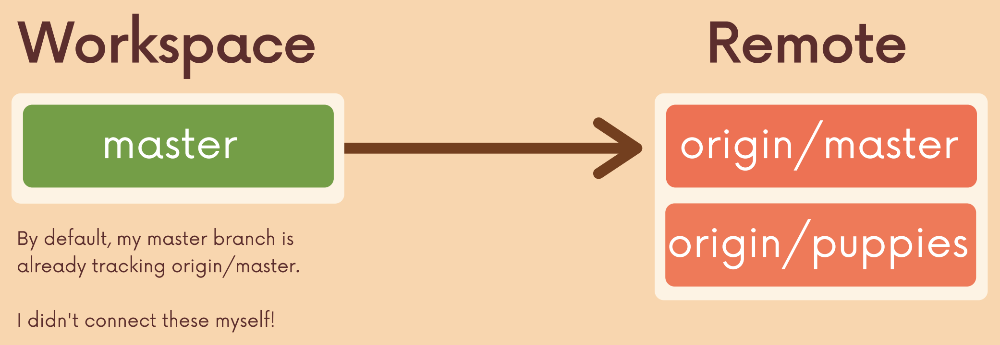
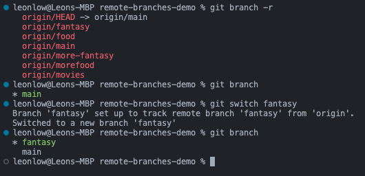
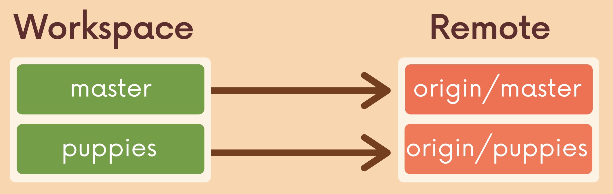

# Fetching and Pulling

## Remote Tracking Branch

- Reference to the state of the master branch on the remote.
- It is a bookmark pointing to the last known commit on the master branch on origin
- Follows the pattern `<remote>/<branch>`
    - `origin/master`: references the state of the master branch on the remote repo named origin.
    - E.g., `upstream/bugfix`: references the state of the bugfix branch on the remote named upstream (common remote name).
- Interpreted as "At the time you last communicated with this remote repository, here is where x branch was pointing."



## Making commits locally

- After making 2 commits locally, the master branch reference moves ahead by 2.
- `origin/master` does not move.



```bash
leonlow@Leons-MBP test_git % git status
On branch main
Your branch is ahead of 'origin/main' by 2 commits.

leonlow@Leons-MBP test_git % git status
On branch main
Your branch is up to date with 'origin/main'.
```

- `git checkout origin/master`
    - Can check the remote branch pointers. Goes into Detached HEAD.

## `git branch -r`

- `git branch -r`
    - View the remote branches our local repository knows about.



## Cloning

- After cloning a repository, we have all the data and Git history for the project.
- However, not all of it is in the local workspace.
- E.g., The remote repository has the branch *puppies* but when ran with `git branch`, it only shows *master*.



- `git checkout origin/puppies` will put us in detached HEAD. Can be used to check what is in `origin/puppies` before working on that branch locally.
- `git switch <remote_name>`
    - To create a new local branch from the remote branch of the same name.
    - E.g., `git switch puppies` makes me a local puppies branch and sets it up to track the remote branch `origin/puppies`.
    - Old way of doing it: `git checkout --track origin/puppies`




## Fetching

- `git fetch`

## Pulling

- `git pull` = `git fetch` + `git merge`
