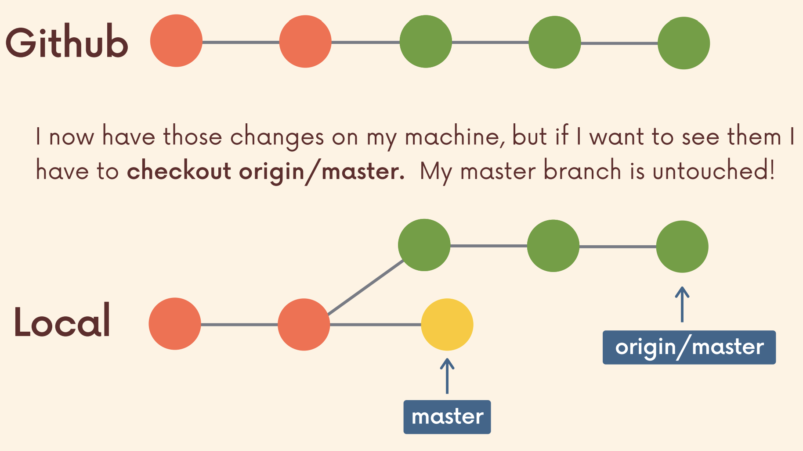
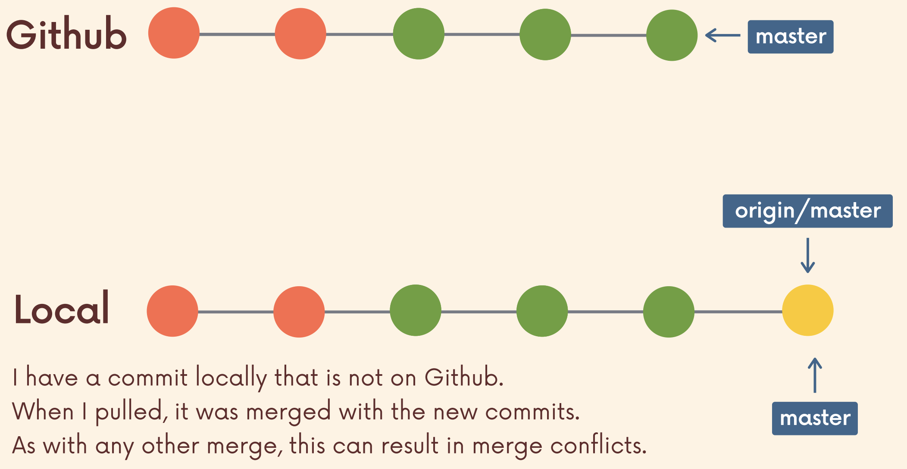
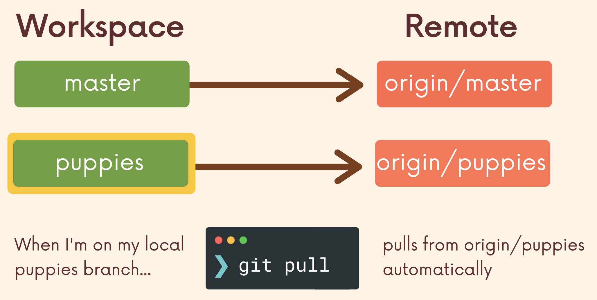

# Fetching and Pulling

## Remote Tracking Branch

- Reference to the state of the master branch on the remote.
- It is a bookmark pointing to the last known commit on the master branch on origin
- Follows the pattern `<remote>/<branch>`
  - `origin/master`: references the state of the master branch on the remote repo named origin.
  - E.g., `upstream/bugfix`: references the state of the bugfix branch on the remote named upstream (common remote name).
- Interpreted as "At the time you last communicated with this remote repository, here is where x branch was pointing."


## Making commits locally

- After making 2 commits locally, the master branch reference moves ahead by 2.
- `origin/master` does not move.


```bash
leonlow@Leons-MBP test_git % git status
On branch main
Your branch is ahead of 'origin/main' by 2 commits.

leonlow@Leons-MBP test_git % git status
On branch main
Your branch is up to date with 'origin/main'.
```

- `git checkout origin/master`
  - Can check the remote branch pointers. Goes into Detached HEAD.

## `git branch -r`

- `git branch -r`
  - View the remote branches our local repository knows about.


## Cloning

- After cloning a repository, we have all the data and Git history for the project.
- However, not all of it is in the local workspace.
- E.g., The remote repository has the branch _puppies_ but when ran with `git branch`, it only shows _master_.


- `git checkout origin/puppies` will put us in detached HEAD. Can be used to check what is in `origin/puppies` before working on that branch locally.
- `git switch <remote_name>`
  - To create a new local branch from the remote branch of the same name.
  - E.g., `git switch puppies` makes me a local puppies branch and sets it up to track the remote branch `origin/puppies`.
  - Old way of doing it: `git checkout --track origin/puppies`


## Fetching

- Fetching allows us to download changes from a remote repository but those changes will not be automatically integrated into the working files.
  - "go and get the latest information from GitHub, but don't screw up my working directory".
- Can see what others have worked on, without having to merge those changes into the local repository.
- `git fetch <remote>`
  - Fetches branches and history from a specific remote repository.
  - Only updates remote tracking branches.
  - If only type `git fetch`, remote branch defaults to origin.
  - E.g., `git fetch origin` fetches all changes from the origin remote repository.
- `git fetch <remote> <branch>`
  - Fetches a specific branch from a remote.
  - E.g., `git fetch origin master` retrieves the latest information from the master branch on the origin remote repository.



## Pulling

- Retrieve changes from a remote repository.
- Unlike fetch, pull updates the HEAD branch changes retrieved from the remote.
  - "go and download data from GitHub AND immediately update my local repo with those changes"
- `git pull` = `git fetch` + `git merge`
- `git pull <remote> <branch>`
  - Specify the particular remote and branch to pull.
  - Important to run this command from the correct branch. Whatever branch we run it from is where the changes will be merged into.
  - E.g., `git pull origin master` would fetch the latest information from the origin's master branch and merge those changes into our current branch.
- Pulling can result in **merge conflicts**.



- `git pull`
  - Running `git pull` without specifying the remote or branch to pull from.
  - remote defaults to origin.
  - branch defaults to whatever tracking connection is configured for your current branch.



## `git fetch` vs `git pull`

|                        `git fetch`                         |                            `git pull`                             |
| :--------------------------------------------------------: | :---------------------------------------------------------------: |
|               Get changes from remote branch               |                  Get changes from remote branch.                  |
| Updates the remote tracking branches with the new changes. | Updates the current branch with the new changes, merging them in. |
|   Does not merge changes onto your current HEAD branch.    |                  Can result in merge conflicts.                   |
|                   Safe to do at anytime.                   |         Not recommended if you have uncommitted changes.          |
