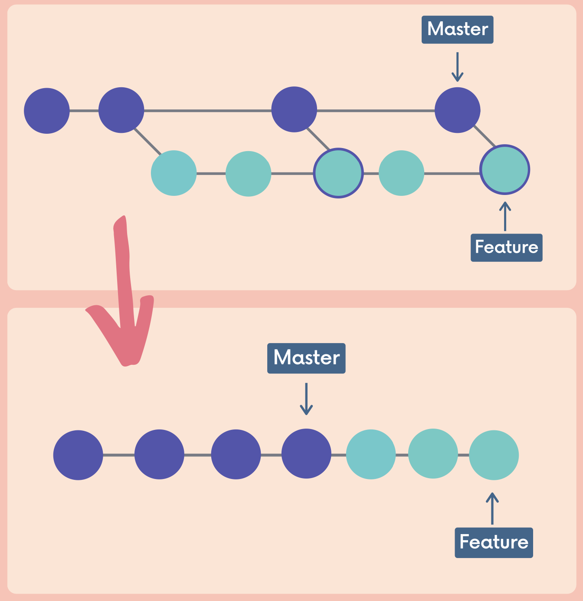

# Git Rebase

- Can use git merge instead of git rebase.
  - avoid having too many merge commits.
  - rewrites commit hash.
- Used to cleanup git history.

## Merging vs Rebasing

- With merging, we create many merge commits if we need to pull content from the master to the feature branch.
  - the feature branch's history becomes very muddied.
- Can **rebase** the feature branch onto the master branch.
  - Moves the entire feature branch so that it BEGINS at the tip of the master branch.
  - All of the work is still there, but we have **re-written history**.
  - Instead of using a merge commit, rebasing rewrites history by **creating new commits** for each of the original feature branch commits.
  - New commit hashes are generated for the feature branch commits.
- With rebase, we get a much cleaner project history.
- No unnecessary merge commits and we end up with a linear project history.

```git
git switch feature
git rebase master
```



## When not to use git rebase

- Never rebase commits that have been shared with others.
- If you have already pushed commits up to GitHub (remote repository), do not rebase them unless no one on the team is using those commits.
- Don't want to rewrite any git history that other people already have.
- Tedious to reconcile the alternate histories.

