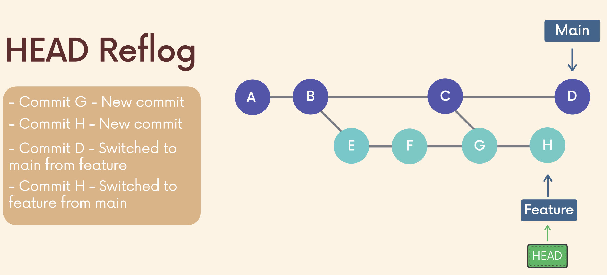

# Git Reflogs - Retrieving "Lost" Work

- Git keeps a record of when the tips of branches and other references were updated in the repo.
- Can view and update these reference logs using the git reflog command.



## Limitations of Git Reflog

- Git only keeps reflogs **locally**, not shared with collaborators.
- Reflogs also expire. Git cleans out old entries after around 90 days (configurable).

## `git reflog`

- `git reflog` or `git reflog show` or `git reflog show HEAD`
    - shows the log of a specific reference (default to HEAD).
- `git reflog show <branch_name>`
    - view the logs for the tip of the specified branch

## Reflog References

- Access specific git refs `name@{qualifier}`.
- Use this syntax to access specific ref pointers and can pass them to other commands including checkout, reset and merge.

## Timed Referenes

- Every entry in the reference logs has a timestamp associated with it.
- Can filter reflogs entries by time/date by using time qualifiers like
    - 1.day.ago
    - 3.minutes.ago
    - yesterday
    - Fri, 12 Feb 2023, 14:06:21 -0800

```git
git reflog master@{one.week.ago}
git checkout bugfix@{2.days.ago}
git diff main@{0} main@{yesterday}
```

## Reflogs Rescue

- Can sometimes use reflog entries to access commits that seem lost and are not appearing in git log.
- E.g., Interactive rebase on feature branch by `fixup`
    - Let's say now we don't want to mash the commits and want to revert back to the old commit.
    - Use `git reflog` to get the commit hash of the old commit.
    - `git reset --hard <commit_hash>`
    - Run `git log --oneline` to view the commits.